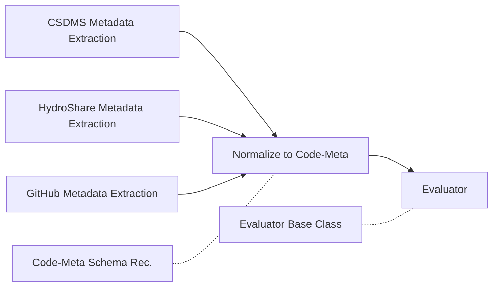

## A Graphical Representation of our Work

```mermaid
flowchart LR;
  id1[CSDMS Metadata Extraction] --> id4[Normalize to Code-Meta] 
  id2[HydroShare Metadata Extraction] --> id4[Normalize to Code-Meta] 
  id3[GitHub Metadata Extraction] --> id4[Normalize to Code-Meta]
  id4[Normalize to Code-Meta] -->  id5[Evaluator]
  id7[Code-Meta Schema Rec.] -.- id4[Normalize to Code-Meta]
  id6[Evaluator Base Class] -.- id5[Evaluator] 
```
