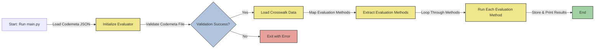

# FAIR4RS Evaluation Framework

## Overview

This section of the repository contains a custom framework for evaluating research software compliance with the [FAIR Principles for research software](https://www.nature.com/articles/s41597-022-01710-x) using metadata from a [Codemeta file](https://codemeta.github.io/). Note that this framework is in early development and features are subject to change.

## Installation

### Using Conda
To set up the environment, use the provided `environment.yml` file:
```sh
conda env create -f environment.yml
conda activate fair4rs-evaluation-env
```

## Project Structure and Workflow Diagram
```
fair4rs_comses/
│── main.py               # Main script to run the evaluation
│── constants.py          # Defines constants used across modules
│── evaluators.py         # Evaluation logic for Codemeta compliance
│── environment.yml       # Conda environment dependencies
│── README.md             # Documentation
│── crosswalks/           # FAIR4RS-to-Codemeta mappings
│── codemeta_examples/    # Example Codemeta JSON files
    │── valid/                # Valid Codemeta files (via codemeticulous)
    │── invalid/              # Invalid Codemeta files (via codemeticulous)
└── utils/
    │── codemeta_loader.py    # Loads and parses Codemeta JSON
    │── codemeta_parser.py    # Extracts relevant metadata
    │── crosswalk_loader.py   # Loads crosswalk CSV mappings
    │── evaluator_utils.py    # Helper functions for evaluation
```




## How to use
To evaluate a Codemeta JSON file, run:
```sh
python main.py path/to/codemeta.json
```
Note that the example codemeta files are under the `codemeta_examples` folder.  This will output the evaluation results, detailing compliance with FAIR4RS guidelines. Below is an example result using [HydroTrend.json](codemeta_examples/valid/HydroTrend.json) as example:

```sh
(fair4rs-evaluation-env) C:\Users\AbnerBogan\Code\FAIRRS-Evaluation\evaluators\fair4rs_comses>python main.py codemeta_examples/valid/HydroTrend.json
codemeta_examples/valid/HydroTrend.json is a valid codemeta file.
evalA1 result: Need codemeta property in crosswalk.
evalA1_1 logs: https://csdms.colorado.edu/pub/models/doi-source-code/hydrotrend-10.1594.IEDA.100135-3.0.2.tar.gz in codemeta property 'downloadUrl' provides access to the software.
evalA1_1 logs: https://csdms.colorado.edu/pub/models/doi-source-code/hydrotrend-10.1594.IEDA.100135-3.0.2.tar.gz in codemeta property 'installUrl' provides access to the software.
evalA1_1 logs: https://spdx.org/licenses/GPL-2.0.html in codemeta property 'license' provides access to the software.
evalA1_1 logs: https://csdms.colorado.edu/wiki/Model:HydroTrend in codemeta property 'url' provides access to the software.
evalA1_1 result: True
evalA1_2 logs: Challenging to implement.
evalA1_2 result: False
evalA2 logs: https://csdms.colorado.edu/wiki/Model:HydroTrend in codemeta property 'identifier' provides access to the software metadata.
evalA2 logs: https://csdms.colorado.edu/wiki/Model:HydroTrend in codemeta property 'url' provides access to the software metadata.
evalA2 result: True
evalF1 logs: https://doi.org/10.1594/IEDA/100135 in codemeta property 'identifier' is a globally unique and persistent identifier.
evalF1 result: True
evalF1_1 result: Need codemeta property in crosswalk.
evalF1_2 logs: 3.0.2 in codemeta property 'softwareVersion' represents valid semantic versioning.
evalF1_2 result: True
evalF2 result: True
evalF3 logs: Challenging to implement.
evalF3 result: False
evalF4 logs: Challenging to implement.
evalF4 result: False
evalI1 result: Need codemeta property in crosswalk.
evalI2 logs: Challenging to implement.
evalI2 result: False
evalR1 result: Need codemeta property in crosswalk.
evalR1_1 result: False
evalR1_2 logs: Challenging to implement.
evalR1_2 result: False
evalR2 result: Need codemeta property in crosswalk.
evalR3 result: Need codemeta property in crosswalk.
```